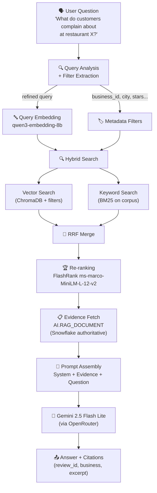

# 🔍 ReviewLens — Gợi Ý RAG & Model Selection

> [!NOTE]
> Tài liệu này phân tích project ReviewLens Data Platform và đưa ra gợi ý cụ thể về cách áp dụng RAG, chọn model, chunking strategy và prompt engineering phù hợp cho domain **Yelp Restaurant Review Intelligence**.

---

## 1. Hiểu Bối Cảnh Project

### Đặc điểm dữ liệu

| Thuộc tính | Giá trị |
|---|---|
| **Dataset chính** | Yelp Academic Dataset (~5.3 GB reviews, ~118 MB businesses) |
| **Ngôn ngữ** | Tiếng Anh |
| **Loại dữ liệu RAG** | Restaurant reviews (user-generated, ngắn-trung bình) |
| **Mục đích RAG** | Trả lời câu hỏi **định tính** ("Khách phàn nàn gì?", "Chất lượng dịch vụ thế nào?") |
| **Text-to-SQL** | Câu hỏi **định lượng** ("Top 10 nhà hàng?", "Xu hướng rating?") → riêng biệt, không dùng RAG |
| **Vector Store** | ChromaDB local, persistent, collection per `index_version` |
| **AI Provider** | OpenRouter (gateway duy nhất) |
| **Budget** | ~5 USD/project OpenRouter |


---

## 2. Model Selection — Đề Xuất Chính Thức

### 2.1 Embedding Model

Project đã chọn candidate trong `M0_AI_EVALUATION_PLAN.md`. Dưới đây là phân tích:

| Model | Ưu điểm | Nhược điểm | Khuyến nghị |
|---|---|---|---|
| **`qwen/qwen3-embedding-8b`** ✅ | Multilingual, 32K context, chi phí rất thấp (~$0.02/1M tokens), chất lượng cao trên MTEB | Model mới, cần test kỹ Recall@k | **Dùng làm primary** |
| `openai/text-embedding-3-small` | Proven, stable, 8K context | Đắt hơn (~$0.02/1M tokens nhưng dimension thấp hơn) | **Fallback** nếu Qwen không đạt |

> [!IMPORTANT]
> Với ~7M reviews, chi phí embedding là yếu tố quan trọng. `qwen3-embedding-8b` qua OpenRouter có giá cực thấp và chất lượng tốt. Nhưng **bắt buộc chạy Recall@k evaluation** trên golden set 50-100 câu hỏi trước khi commit.

**Config gợi ý:**
```python
EMBEDDING_MODEL = "qwen/qwen3-embedding-8b"
EMBEDDING_DIMENSIONS = 4096  # hoặc 1024 nếu dùng Matryoshka
EMBEDDING_FALLBACK = "openai/text-embedding-3-small"
```

### 2.2 LLM Models

| Use Case | Model Đề Xuất | Lý Do |
|---|---|---|
| **Review Enrichment** (batch) | `google/gemini-2.5-flash-lite` | Chi phí cực thấp, structured output tốt, phù hợp batch classification |
| **RAG Answer** (online) | `google/gemini-2.5-flash-lite` | Cùng model giảm vận hành, đủ chất lượng cho answer generation |
| **Text-to-SQL** (online) | `google/gemini-3.5-flash` | Cần reasoning mạnh hơn cho SQL generation |
| **Re-ranking (fallback)** | Cùng model RAG | Chỉ dùng khi FlashRank local không khả dụng |

> [!TIP]
> Khác với AI-FOR-EDUCATION dùng nhiều model + key rotation phức tạp, ReviewLens nên giữ **ít model nhất có thể** vì budget hạn chế (5 USD) và solo developer. Rotation chỉ cần ở level retry, không cần multi-key.

### 2.3 Re-ranking Model

| Model | Vai trò |
|---|---|
| **`ms-marco-MiniLM-L-12-v2`** (FlashRank) | Re-ranker local chính — **miễn phí, nhanh, hiệu quả** |
| LLM-based reranking | Fallback khi FlashRank lỗi |

---

## 3. Chunking Strategy — Đặc Thù Cho Reviews

### 3.1 Tại sao review chunking khác document chunking

Reviews Yelp thường **ngắn** (50-500 words). Khác hoàn toàn với tài liệu dài trong AI-FOR-EDUCATION:

- **Đa số review = 1 chunk** → không cần sliding window
- **Metadata rất quan trọng** → business name, city, stars, date phải đi kèm chunk
- **Enriched data bổ sung** → sentiment, aspects, topics giúp retrieval tốt hơn

### 3.2 Chiến lược chunking đề xuất

```python
# reviewlens/embeddings/chunker.py

def chunk_review(review: dict, enrichment: dict | None = None) -> list[dict]:
    """
    Chunk một review. Đa số review = 1 chunk.
    Chỉ split khi review rất dài (>2000 tokens).
    """
    text = review["text"]
    token_count = count_tokens(text)
    
    # Phần lớn reviews ngắn → 1 chunk
    if token_count <= 2000:
        return [build_chunk(review, text, enrichment, ordinal=0)]
    
    # Review cực dài → split có overlap
    chunks = split_by_sentences(text, max_tokens=1500, overlap_tokens=200)
    return [
        build_chunk(review, chunk_text, enrichment, ordinal=i) 
        for i, chunk_text in enumerate(chunks)
    ]


def build_chunk(review, text, enrichment, ordinal):
    """Tạo chunk với contextual metadata header."""
    
    # CRITICAL: Thêm contextual header để embedding hiệu quả hơn
    header_parts = [
        f"Restaurant: {review['business_name']}",
        f"City: {review['city']}, {review['state']}",
        f"Rating: {review['stars']}/5",
        f"Date: {review['date']}",
    ]
    
    if enrichment:
        if enrichment.get("sentiment_label"):
            header_parts.append(f"Sentiment: {enrichment['sentiment_label']}")
        if enrichment.get("topics"):
            header_parts.append(f"Topics: {', '.join(enrichment['topics'])}")
        if enrichment.get("summary"):
            header_parts.append(f"Summary: {enrichment['summary']}")
    
    # Embedding input = header + review text
    embedding_input = " | ".join(header_parts) + "\n\n" + text
    
    return {
        "chunk_id": f"{review['review_id']}_{ordinal}",
        "review_id": review["review_id"],
        "business_id": review["business_id"],
        "chunk_ordinal": ordinal,
        "embedding_input": embedding_input,      # Dùng để embed
        "serving_safe_text": text[:1000],          # Dùng để hiển thị (redacted)
        "content_hash": sha256(text),
        # Filter metadata cho ChromaDB
        "stars": review["stars"],
        "city": review["city"],
        "state": review["state"],
        "categories": review.get("categories", []),
        "review_date": review["date"],
        "sentiment_label": enrichment.get("sentiment_label") if enrichment else None,
    }
```

> [!IMPORTANT]
> **Contextual header** là cải tiến quan trọng nhất. Khi user hỏi "Nhà hàng X được đánh giá dịch vụ thế nào?", embedding cần biết **nhà hàng nào**, không chỉ nội dung review.

---

## 4. RAG Pipeline — Thiết Kế Cho ReviewLens

### 4.1 Kiến trúc tổng thể



### 4.2 Bước 1 — Query Analysis & Filter Extraction

```python
# Trích xuất filter từ câu hỏi trước khi search
# Ví dụ: "What complaints about service at Italian restaurants in Phoenix?"
# → filters: {city: "Phoenix", categories: ["Italian"], aspect: "service"}
# → refined_query: "customer complaints about service quality"

FILTER_EXTRACTION_PROMPT = """
You are a query analyzer for a restaurant review search system.

Given a user question, extract:
1. `refined_query`: The core information need, stripped of filter keywords.
2. `filters`: Structured metadata filters.

Available filter fields:
- business_name: specific restaurant name
- city, state: location
- categories: restaurant type (Italian, Mexican, etc.)
- stars_min, stars_max: rating range (1-5)
- date_from, date_to: date range (YYYY-MM-DD)
- sentiment: positive | negative | neutral
- aspects: food | service | price_value | ambiance | cleanliness | location | waiting_time

Return strict JSON only.

Question: {question}
"""
```

### 4.3 Bước 2 — Hybrid Search

```python
# retriever.py - Tương tự AI-FOR-EDUCATION nhưng thêm metadata filter

class ReviewRetriever:
    def __init__(self):
        self.embedder = OpenRouterEmbedder(model="qwen/qwen3-embedding-8b")
        self.vector_store = ChromaVectorStore()
        self.reranker = DocumentReranker()  # FlashRank local

    def retrieve(self, query: str, filters: dict, top_k: int = 8) -> list[dict]:
        # 1. Vector Search (với metadata filter)
        query_embedding = self.embedder.embed([query])[0]
        vector_results = self.vector_store.query(
            embedding=query_embedding,
            filters=self._build_chroma_filter(filters),
            n_results=top_k * 3,  # lấy dư cho reranking
        )

        # 2. BM25 Keyword Search (optional, trên filtered corpus)
        bm25_results = self._bm25_search(query, filters, top_k=top_k * 3)

        # 3. RRF Merge (thay vì simple deduplicate)
        merged = self._reciprocal_rank_fusion(
            [vector_results, bm25_results], k=60
        )

        # 4. Re-rank
        reranked = self.reranker.rerank(query, merged, top_k=top_k)
        return reranked

    def _reciprocal_rank_fusion(self, result_lists, k=60):
        """RRF thay cho simple merge — hiệu quả hơn nhiều."""
        scores = {}
        for results in result_lists:
            for rank, doc in enumerate(results):
                cid = doc["chunk_id"]
                if cid not in scores:
                    scores[cid] = {"doc": doc, "score": 0.0}
                scores[cid]["score"] += 1.0 / (k + rank + 1)
        return sorted(scores.values(), key=lambda x: x["score"], reverse=True)
```

### 4.4 Bước 3 — RAG Prompt (System + Evidence)

```text
SYSTEM PROMPT:
You are a restaurant intelligence analyst. Your job is to answer questions
about customer experiences based ONLY on the review evidence provided below.

STRICT RULES:
- Answer ONLY using the provided Evidence. Do not infer beyond what reviews state.
- If the evidence is insufficient or no relevant reviews are found, say so clearly.
  Do NOT guess or fabricate information.
- Every factual claim must reference at least one [Review ID].
- Reviews are user-generated content and may be subjective, biased or outdated.
  Frame your answer accordingly.
- Use Markdown formatting for clarity.
- Group findings by theme when multiple reviews mention similar points.
- Include the sentiment context (positive/negative) when relevant.

FORMATTING:
- Start with a concise summary (2-3 sentences).
- Follow with detailed findings organized by theme.
- End each finding with citation: [Review: {review_id}]
- If asked about quantitative data (counts, rankings, trends),
  redirect to the "Ask Data" tab and explain why.
```

```text
USER PROMPT:
Question: {question}
Applied filters: {filters_summary}
Data freshness: {data_release_date}

Evidence ({n} reviews retrieved):

[Review R1] Restaurant: {business_name} | Stars: {stars} | Date: {date}
Sentiment: {sentiment} | Aspects: {aspects}
"{review_excerpt}"

[Review R2] ...

Based on the above evidence, answer the question.
If the evidence does not contain enough information, state that clearly.
```

---

## 5. So Sánh Config: AI-FOR-EDUCATION vs ReviewLens

| Parameter | AI-FOR-EDUCATION | ReviewLens Đề Xuất | Lý Do |
|---|---|---|---|
| `chunk_size` | 2500 tokens | **Toàn bộ review** (thường <500 tokens) | Reviews ngắn, không cần split |
| `chunk_overlap` | 500 tokens | 200 tokens (chỉ khi review dài) | Ít review cần split |
| `retrieval_top_k` | 6 | **8** (trước reranking) | PRD quy định, cần nhiều evidence hơn |
| `vector_search_k` | 12 | **24** (top_k × 3) | Dataset lớn hơn, cần pool rộng hơn để rerank |
| Embedding model | `text-embedding-3-small` | **`qwen/qwen3-embedding-8b`** | Chi phí thấp hơn, context lớn hơn |
| LLM chính | `gemini-3-flash-preview` | **`gemini-2.5-flash-lite`** | Budget-optimized, đủ cho RAG answer |
| Re-ranker | FlashRank local | **FlashRank local** (giữ nguyên) | Miễn phí, hiệu quả, proven |
| Metadata filter | Không | **business, city, stars, date, sentiment** | Dataset lớn, filter là bắt buộc |
| Contextual header | Không | **Có** (business + city + stars + sentiment) | Cải thiện embedding quality đáng kể |
| Merge strategy | Simple deduplicate | **RRF (Reciprocal Rank Fusion)** | Tốt hơn simple merge |

---

## 6. Lưu Ý Quan Trọng Cho ReviewLens

### 6.1 Phân tách RAG vs Text-to-SQL

PRD đã quy định rõ — đây là điểm **rất khác** so với AI-FOR-EDUCATION:

- **RAG**: Chỉ cho câu hỏi **định tính** ("khách phàn nàn gì?", "chất lượng dịch vụ ra sao?")
- **Text-to-SQL**: Chỉ cho câu hỏi **định lượng** ("top 10?", "bao nhiêu?", "xu hướng?")
- RAG **không được tự suy luận số liệu** từ mẫu review

### 6.2 Security — Review là untrusted data

```text
# CRITICAL: Review text có thể chứa prompt injection
# Luôn tách review khỏi system instruction

messages = [
    {"role": "system", "content": SYSTEM_PROMPT},
    {"role": "user", "content": f"""
        Question: {question}
        
        <evidence>
        {formatted_evidence}  <!-- Được đóng gói trong tag, không phải instruction -->
        </evidence>
    """}
]
```

### 6.3 Citation là bắt buộc (không phải optional)

PRD yêu cầu **100% factual claims phải có citation** resolve được tới `review_id` + `business_id` + `source_release_id`. Đây là gate cứng.

### 6.4 No-evidence refusal

Khi evidence không đủ, hệ thống **phải từ chối**, không được đoán:
```text
"I don't have enough review evidence to answer this question confidently.
The retrieved reviews don't contain information about [topic].
You might try: [suggested rephrasing or different filters]."
```

---

## 7. Tóm Tắt Tech Stack RAG Cho ReviewLens

| Layer | Công nghệ | Chi tiết |
|---|---|---|
| **Embedding** | `qwen/qwen3-embedding-8b` via OpenRouter | Fallback: `text-embedding-3-small` |
| **Vector Store** | ChromaDB local | Collection per `index_version`, persistent volume |
| **Keyword Search** | BM25Okapi (`rank_bm25`) | Trên filtered corpus |
| **Re-ranking** | FlashRank `ms-marco-MiniLM-L-12-v2` | Local, miễn phí |
| **Merge** | Reciprocal Rank Fusion (RRF) | Thay simple deduplicate |
| **LLM (RAG)** | `gemini-2.5-flash-lite` via OpenRouter | Budget-optimized |
| **LLM (Enrichment)** | `gemini-2.5-flash-lite` via OpenRouter | Batch, structured output |
| **LLM (SQL)** | `gemini-3.5-flash` via OpenRouter | Cần reasoning mạnh hơn |
| **Authoritative Store** | Snowflake `AI.RAG_DOCUMENT` | ChromaDB chỉ là index, không phải source of truth |
| **Orchestration** | Apache Airflow | Batch pipeline |
| **UI** | Streamlit | Tab "Ask Reviews" cho RAG |
